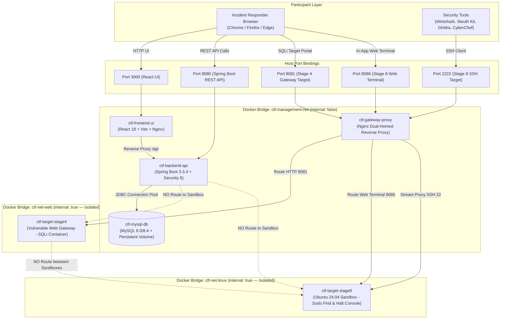

# CyberVault: Operation Aegis Breach — CTF Play Box

A comprehensive, production-grade, full-stack cybersecurity Capture The Flag (CTF) training platform and isolated play box developed for **IE3132 - Penetration Testing** (Year 3, Semester 1).

**Group ID: 46**
- **Member 1 (Lead)**: De Silva N H H D L (`IT24103894`) — *CTF Platform and Architecture*
- **Member 2**: Fernando B S D (`IT24103855`) — *Challenge Design A (Stages 1–4)*
- **Member 3**: Hettiarachchi H P P (`IT24103538`) — *Challenge Design B (Stages 5–8)*
- **Member 4**: Liyanagamage S S (`IT24104243`) — *Integration, Testing & Documentation*

---

## 📖 The Interconnected Narrative: *Operation Aegis Breach*

*At 02:40 UTC on August 14, 2026, security alarms triggered across the HexaTech Core Grid Facility. A rogue senior infrastructure engineer, Marcus Vance (ID: MV-4092), initiated an insider sabotage sequence before fleeing the premises. As an incident responder, you must trace Marcus Vance's digital breadcrumbs across 8 sequentially linked stages to halt the sabotage protocol.*

```
Stage 1: Public Footprint ──► Stage 2: Abandoned Badge ──► Stage 3: C2 Intercept ──► Stage 4: Perimeter Gateway
(OSINT / Recon)               (Steganography)             (Cryptography)             (Web Security SQLi)
                                                                                            │
Stage 8: Core Mainframe  ◄── Stage 7: Sabotage Binary ◄── Stage 6: Wiped Storage  ◄── Stage 5: Wiretap Network
(Capstone Linux PrivEsc)      (Reverse Engineering)       (Digital Forensics)        (Network Packet Analysis)
```

---

## 🎯 8-Stage Progressive Challenge Pathway (1,500 Total Points)

| Stage | Domain | Title | Difficulty | Points | Target / Artifact | Narrative Connection & Objective |
| :---: | :--- | :--- | :---: | :---: | :--- | :--- |
| **01** | **OSINT / Recon** | *The Public Footprint* | **Easy** | 100 | Interactive: `/stage1-osint` | Inspect Marcus's public employee profile and archived forum thread to correlate his alias and assemble the verification flag. |
| **02** | **Steganography** | *The Abandoned Badge* | **Easy** | 100 | Download: `evidence_badge.png` | Extract LSB UTF-8 note containing the flag and Stage 3 C2 channel key (`AEGIS_KEY_4092`); ignore Base64 EXIF decoy. |
| **03** | **Cryptography** | *The C2 Intercept* | **Moderate** | 150 | Download: `intercepted_payload.txt` | Decode outer Base64 and decrypt polyalphabetic Vigenère cipher using the Stage 2 key to reveal gateway portal coordinates. |
| **04** | **Web Security** | *Perimeter Gateway Infiltration* | **Moderate** | 150 | Interactive: `/stage4-gateway` | Exploit unparameterized SQL injection to bypass login, capture the web flag, and locate egress network capture. |
| **05** | **Networking** | *The Wiretap Chronicle* | **Mod-Hard** | 200 | Download: `incident_traffic.pcap` | Reassemble unencrypted HTTP POST stream in Wireshark, extract flag, and locate confirmation that Marcus wiped his workstation disk. |
| **06** | **Digital Forensics** | *The Deleted Storage Sector* | **Hard** | 250 | Download: `disk_evidence.raw` | Analyze FAT32 filesystem or carve unallocated clusters to recover deleted archive `forensic_evidence.bak`, server credentials (`player`), and `countdown.elf`. |
| **07** | **Reverse Eng.** | *The Sabotage Binary* | **Hard** | 250 | Download: `countdown.elf` / Workbench: `/stage7-binary` | Reverse byte-wise transform loop `((c ^ 0x5A) + (i*3))` against the table to extract the flag and authorization phrase (`AEGIS-HALT-2026-OMEGA`). |
| **08** | **System Security** | *Core Mainframe Takeover* | **Hard** | 300 | Interactive: `/stage8-terminal` (SSH: 2222) | Escalate user `player` to root via GTFOBins `sudo find`, then execute `/opt/halt_console AEGIS-HALT-2026-OMEGA` to disarm the sabotage sequence. |

---

## 🏗️ Platform & Box Architecture

The platform implements strict network segmentation and isolation per CIS Docker Benchmark guidelines:



---

## 💡 Progressive Hints & Point Penalty Structure

Hint strings are withheld server-side until the user confirms the unlock transaction. Total player score is computed in real-time as:
$$\text{Total Score} = \max\left(0, \sum \text{Solved Stage Points} - \sum \text{Unlocked Hint Penalties}\right)$$

| Stage | Title | Max Points | Tier 1 (-10%) | Tier 2 (-15%) | Tier 3 (-25%) | Min. Score |
| :---: | :--- | :---: | :---: | :---: | :---: | :---: |
| **01** | The Public Footprint | 100 | -10 pts | -15 pts | -25 pts | 50 pts |
| **02** | The Abandoned Badge | 100 | -10 pts | -15 pts | -25 pts | 50 pts |
| **03** | The C2 Intercept | 150 | -15 pts | -23 pts | -37 pts | 75 pts |
| **04** | Perimeter Gateway Infiltration | 150 | -15 pts | -23 pts | -37 pts | 75 pts |
| **05** | The Wiretap Chronicle | 200 | -20 pts | -30 pts | -50 pts | 100 pts |
| **06** | The Deleted Storage Sector | 250 | -25 pts | -38 pts | -62 pts | 125 pts |
| **07** | The Sabotage Binary | 250 | -25 pts | -38 pts | -62 pts | 125 pts |
| **08** | Core Mainframe Takeover | 300 | -30 pts | -45 pts | -75 pts | 150 pts |
| **TOTAL** | **8 Stages Across 8 Domains** | **1,500** | **-150 pts** | **-229 pts** | **-371 pts** | **750 pts** |

---

## 👥 Individual Contribution Matrix (Group ID: 46)

| Member | Student ID | Project Role | Technical Responsibility & Evidence |
| :--- | :---: | :--- | :--- |
| **De Silva N H H D L** | `IT24103894` | **Member 1 (Lead)**<br/>CTF Platform & Architecture | • Spring Boot 3 REST API & Spring Security 6 engine<br/>• React 18 + Vite frontend platform & styling<br/>• Docker Compose multi-network orchestration<br/>• Dual-homed `ctf-gateway` reverse proxy & isolation plan |
| **Fernando B S D** | `IT24103855` | **Member 2**<br/>Challenge Design A (Stages 1–4) | • Storyline & OSINT pages (Stage 1)<br/>• Steganography badge & LSB embedding (Stage 2)<br/>• Cryptographic pipeline (Base64 + Vigenère) (Stage 3)<br/>• Perimeter Gateway SQLi vulnerability & portal (Stage 4) |
| **Hettiarachchi H P P** | `IT24103538` | **Member 3**<br/>Challenge Design B (Stages 5–8) | • Unencrypted packet capture generation (Stage 5)<br/>• Workstation raw disk image & cluster carving (Stage 6)<br/>• Sabotage countdown binary & byte transform logic (Stage 7)<br/>• Ubuntu mainframe sandbox, sudo find & halt console (Stage 8) |
| **Liyanagamage S S** | `IT24104243` | **Member 4**<br/>Integration, Testing & Documentation | • Test strategy & execution (TC-01 through TC-23)<br/>• Acceptance criteria validation & recovery procedures<br/>• Risk register analysis & CIS Docker security audit<br/>• Documentation & project initiation compliance |

---

## 🧪 Comprehensive Verification & Test Matrix (TC-01 to TC-23)

| Test ID | Domain / Area | Test Scenario | Expected Result | Status |
| :---: | :--- | :--- | :--- | :---: |
| **TC-01** | Platform Auth | Register/login; access admin endpoint as player; verify CSRF | Session and role OK; unauthorized requests rejected (401/403) | **PASS** |
| **TC-02** | Platform Auth | Inspect users table on clean deployment | Default admin created with BCrypt hash; password change supported | **PASS** |
| **TC-03** | Flag Validation | Submit correct flag vs. incorrect flag for unlocked stage | Correct flag awarded full points; incorrect flag rejected and logged | **PASS** |
| **TC-04** | Flag Validation | Resubmit already-solved flag; submit flag for locked stage | Resubmission awards 0 pts ("Already solved"); locked submission logged | **PASS** |
| **TC-05** | Hint Penalties | Unlock Tier 1, then Tier 2; attempt Tier 3 without Tier 2 | Sequential unlock enforced; penalties deducted accurately from score | **PASS** |
| **TC-06** | Anti-Cheat | Inspect client JSON responses and browser source | Plaintext flags and hashes never exposed in frontend or API payloads | **PASS** |
| **TC-07** | Rate Limiting | Submit >10 flags/minute; test repeated failed logins | 11th submission throttled (429); account lockout applied after failures | **PASS** |
| **TC-08** | Scoreboard | Multiple users solve challenges with differing hint penalties | Scoreboard ranks by net points, then solve timestamp for tie-breaks | **PASS** |
| **TC-09** | Stage 1 (OSINT) | Correlate profile comment + forum signature | Fragments successfully combine to valid Stage 1 flag | **PASS** |
| **TC-10** | Stage 2 (Stego) | Inspect `evidence_badge.png` metadata vs. LSB note | Decoy EXIF ignored; note reveals Stage 2 flag and channel key | **PASS** |
| **TC-11** | Stage 3 (Crypto) | Decode Base64 and Vigenère decrypt with channel key | Plaintext reveals Stage 3 flag and gateway URL | **PASS** |
| **TC-12** | Stage 4 (Web) | Inject reference SQL authentication bypass | Admin dashboard bypassed; Stage 4 flag successfully retrieved | **PASS** |
| **TC-13** | Stage 5 (Network) | Follow unencrypted HTTP stream in `incident_traffic.pcap` | Reassembles POST session: Stage 5 flag and wipe notice recovered | **PASS** |
| **TC-14** | Stage 6 (Forensics) | Recover deleted archive from `disk_evidence.raw` | Recovers `forensic_evidence.bak`: Stage 6 flag and SSH logins recovered | **PASS** |
| **TC-15** | Stage 7 (Reverse Eng) | Disassemble `countdown.elf`; reverse transform table | Recovers emergency authorization phrase and Stage 7 flag | **PASS** |
| **TC-16** | Stage 8 (Capstone) | Escalate via `sudo find`, run `/opt/halt_console <phrase>` | Root shell spawned; console accepts phrase: Stage 8 capstone flag captured | **PASS** |
| **TC-17** | Isolation | Test outbound network connectivity from sandbox containers | Sandbox ping/curl to external IP fails (`internal: true`) | **PASS** |
| **TC-18** | Network Security | Host port scan against Docker host | Only published ports (3000, 8080, 8081, 8086, 2222) reachable | **PASS** |
| **TC-19** | Resource Caps | Fork bomb and memory stress test inside Stage 8 container | Host CPU/memory unimpacted; container capped at 0.5 CPU / 512 MB | **PASS** |
| **TC-20** | Safety Controls | SQL injection cannot modify DB (`PRAGMA query_only`) | Read-only execution enforced; database structure remains immutable | **PASS** |
| **TC-21** | Reset Mechanism | Execute container recreate and full volume wipe commands | Containers and state restore cleanly to initial pristine condition | **PASS** |
| **TC-22** | Deployment | Clone repo, start stack on clean host with one command | Single command `docker compose up -d --build` deploys full platform | **PASS** |
| **TC-23** | Usability Playtest | Third-year IT student walkthrough without instructor aids | Stages 1–3 completed unaided; story clarity rated high | **PASS** |

---

## 🚀 Quick Start Guide

### 1. One-Command Docker Deployment (Recommended)
```bash
docker compose up -d --build
```
*All 6 microservices (Database, Backend API, Frontend UI, Gateway Proxy, Stage 4 Sandbox, Stage 8 Sandbox) are automatically built, connected, and started.*

### 2. Local Development Deployment
```powershell
# 1. Generate challenge artifacts & SHA-256 manifest
python generate_challenges.py

# 2. Start Spring Boot Backend (Port 8080)
cd ctf-platform-backend
.\mvnw.cmd spring-boot:run

# 3. Start React Frontend (Port 3000)
cd ..\ctf-platform-frontend
npm install
npm run dev
```

---

## 🌐 Platform Port Map & Default Credentials

| Service | Access Point | Default Credentials / Context |
| :--- | :--- | :--- |
| **CTF Web Platform** | [http://localhost:3000](http://localhost:3000) | Register player account or login as admin |
| **Platform Administrator** | [http://localhost:3000/login](http://localhost:3000/login) | **User:** `admin` \| **Pass:** `ChangeMe123!` |
| **REST API & Downloads** | [http://localhost:8080](http://localhost:8080) | Backend REST API & static challenge artifacts |
| **Stage 1 (OSINT Console)** | [http://localhost:3000/stage1-osint](http://localhost:3000/stage1-osint) | Interactive profile & forum inspection |
| **Stage 4 (Gateway Portal)** | [http://localhost:3000/stage4-gateway](http://localhost:3000/stage4-gateway) | Or direct via gateway: `http://localhost:8081` |
| **Stage 7 (Binary Workbench)**| [http://localhost:3000/stage7-binary](http://localhost:3000/stage7-binary) | Interactive decompiler & transform simulator |
| **Stage 8 (Core Mainframe)** | [http://localhost:3000/stage8-terminal](http://localhost:3000/stage8-terminal) | **User:** `player` \| **Pass:** `AegisAccess#2026` (SSH: 2222) |
