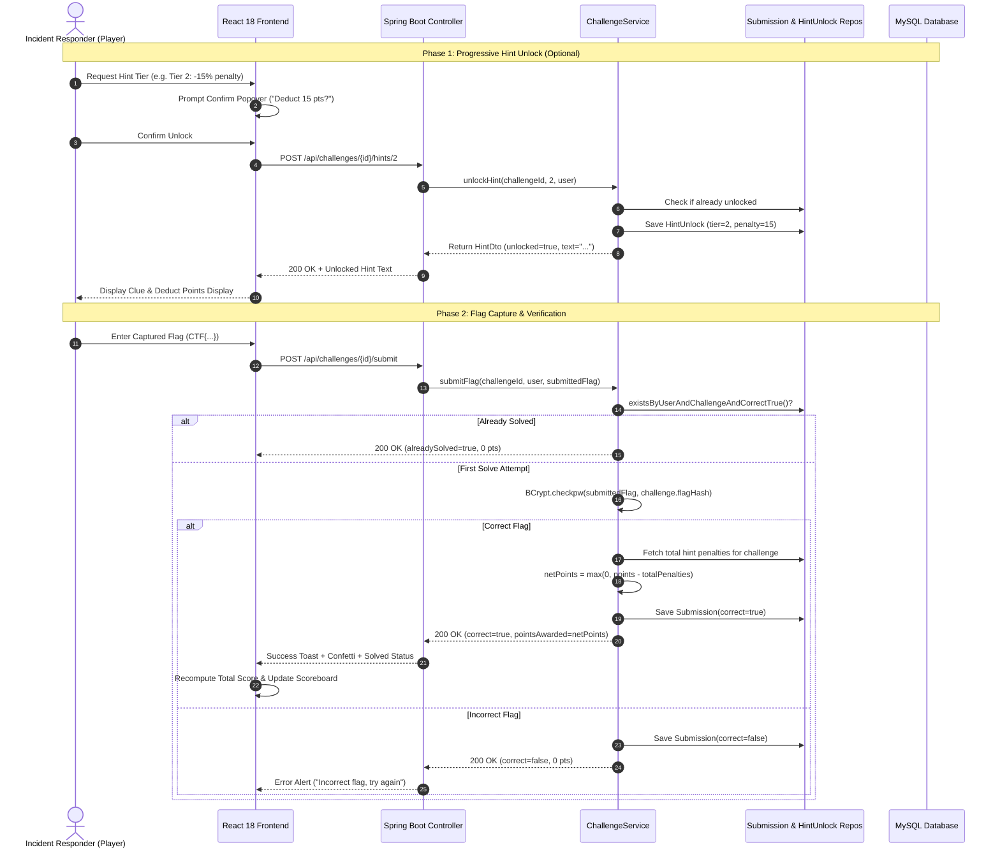

# CyberVault: Operation Aegis Breach — System Architecture & Design

This document details the multi-tier system architecture, container topology, network security boundaries, data flow, and threat model of the CyberVault CTF Platform.

---

## 1. High-Level System Architecture

The platform is architected around strict separation of concerns, dividing user-facing services, stateful persistence, and deliberately vulnerable challenge targets across isolated Docker bridge networks.

```mermaid
graph TB
    subgraph ClientLayer["User Client Layer"]
        Browser["Player / Admin Browser<br/>(Chrome / Firefox / Safari)"]
    end

    subgraph HostNetwork["Host Port Mappings"]
        P3000["Port 3000 (HTTP)"]
        P8080["Port 8080 (REST API)"]
        P8081["Port 8081 (Stage 3 Target)"]
        P2222["Port 2222 (Stage 6 SSH)"]
        P8086["Port 8086 (Stage 6 Web Terminal)"]
    end

    subgraph ManagementNetwork["Docker Bridge: ctf-management-net (internal: false)"]
        Frontend["ctf-frontend-ui<br/>(React 18 + Vite + Tailwind/Vanilla CSS + Nginx)"]
        Backend["ctf-backend-api<br/>(Spring Boot 3.3.4 + Spring Security 6)"]
        Database[("ctf-mysql-db<br/>(MySQL 8.0 Engine + Persistent Volume)")]
        StaticStore["ClassPath Static Artifacts<br/>(/artifacts/*: PCAP, PNG, RAW, TXT)"]
    end

    subgraph SandboxNetwork["Docker Bridge: ctf-sandbox-net (internal: true — Isolated)"]
        Stage3Box["ctf-target-stage3<br/>(Vulnerable Enterprise Gateway - SQLi)"]
        Stage6Box["ctf-target-stage6<br/>(Ubuntu Linux Sandbox - GTFOBins Sudo Find)"]
    end

    %% Client Interactions
    Browser -->|HTTP UI Access| P3000
    Browser -->|REST API Calls /api/*| P8080
    Browser -->|Target Web Portal| P8081
    Browser -->|Interactive Web Shell (ttyd)| P8086
    Browser -->|SSH Terminal Client| P2222

    %% Port Forwarding into Containers
    P3000 --> Frontend
    P8080 --> Backend
    P8081 --> Stage3Box
    P8086 --> Stage6Box
    P2222 --> Stage6Box

    %% Management Communications
    Frontend -->|Reverse Proxy / Direct REST| Backend
    Backend -->|JDBC Connection Pool| Database
    Backend -->|Read Artifacts| StaticStore

    %% Isolation boundary note
    Backend -.->|No Outbound Route to Sandbox| Stage3Box
    Backend -.->|No Outbound Route to Sandbox| Stage6Box
```

---

## 2. Component & Multi-Container Network Topology

The infrastructure deploys via `docker-compose.yml` into two separate virtual networks:

| Network Name | Driver | Routing Scope | Assigned Services | Security Purpose |
| :--- | :---: | :---: | :--- | :--- |
| **`ctf-management-net`** | `bridge` | Internal + Host Forwarding | `ctf-frontend-ui`<br/>`ctf-backend-api`<br/>`ctf-mysql-db` | Handles core CTF application logic, user authentication sessions, scoreboard calculation, and database persistence. |
| **`ctf-sandbox-net`** | `bridge` | **`internal: true`** (Isolated) | `ctf-target-stage3`<br/>`ctf-target-stage6` | Deliberately vulnerable environments. Setting `internal: true` prevents outbound network traffic, disallowing container pivot attacks, university LAN scans, or external C2 connections. |

```
                       ┌────────────────────────────────────────┐
                       │           Host Physical Machine        │
                       └───────────────────┬────────────────────┘
                                           │
         ┌─────────────────────────────────┴─────────────────────────────────┐
         ▼                                                                   ▼
┌─────────────────────────────────┐                       ┌──────────────────────────────────┐
│  ctf-management-net (Bridge)    │                       │   ctf-sandbox-net (Isolated)     │
│  - ctf-frontend (Port 3000)     │                       │   - ctf-target-stage3 (Port 8081)│
│  - ctf-backend (Port 8080)      │   [No Inter-Network]  │   - ctf-target-stage6 (Port 8086)│
│  - ctf-mysql-db (Port 3306)     │◄─────────────────────►│     (internal: true - NO WAN)    │
└─────────────────────────────────┘                       └──────────────────────────────────┘
```

---

## 3. Data Flow & Anti-Cheat Flag Verification

Flags are protected using modern cryptographic controls:
1. **BCrypt Hashing**: Flag strings are hashed with BCrypt (`$2a$10$...`) server-side upon initialization in `DataSeeder.java` or during admin configuration.
2. **Zero Plaintext Storage**: Plaintext flags are never stored in MySQL tables.
3. **Serialization Defense**: The `flagHash` field is annotated with `@JsonIgnore` in `Challenge.java`, ensuring hashes are physically excluded from REST payloads.
4. **Idempotent Scoring**: Submission validation verifies prior successful solves to prevent duplicate credit awards.



---

## 4. Progressive Hint & Point Penalty System

To satisfy rigorous CTF learning standards, challenges do not give away single free answers. Each stage incorporates **three progressive escalation tiers** that deduct points proportionately upon unlock:

| Tier | Purpose | Penalty Ratio | Example (100-pt Stage) | Example (250-pt Stage) |
| :---: | :--- | :---: | :---: | :---: |
| **Tier 1** | **Subtle Orientation Clue**: Directs attention to high-level concept or non-obvious file structure without revealing tools. | **-10%** | -10 pts | -25 pts |
| **Tier 2** | **Technical / Tooling Guide**: Recommends concrete tools (`exiftool`, Wireshark filters, GTFOBins) and syntax templates. | **-15%** | -15 pts | -38 pts |
| **Tier 3** | **Explicit Solution Blueprint**: Exact command execution parameters or payload structure to guarantee progress if totally stuck. | **-25%** | -25 pts | -62 pts |

### Security Properties of Hint Delivery:
- **Zero Client-Side Leaks**: Locked hints have `text: null` in the REST payload. Inspecting browser DevTools or Network tabs reveals no clue content prior to explicit unlock.
- **Idempotent Penalties**: Unlocking an already-unlocked hint returns the existing text without re-charging the penalty.
- **Scoreboard Integration**: Total net player points reflect earned challenge points minus all hint penalties incurred across all stages.

---

## 5. Threat Model & Security Boundaries

```
                 [ External Threats: Internet / Hostile LAN ]
                                      │
               [ FIREWALL / HOST PORT BINDINGS (3000, 8080) ]
                                      │
            ┌─────────────────────────▼──────────────────────────┐
            │               TRUST BOUNDARY: CORE APP             │
            │  - Spring Security Authentication Filter           │
            │  - Session-Based Authorization (ROLE_PLAYER/ADMIN) │
            │  - BCrypt Hash Verification Engine                 │
            └─────────────────────────┬──────────────────────────┘
                                      │
       ┌──────────────────────────────┴──────────────────────────────┐
       ▼                                                             ▼
┌─────────────────────────────┐               ┌─────────────────────────────────────┐
│ TRUST BOUNDARY: DATABASE    │               │ TRUST BOUNDARY: SANDBOX TARGETS     │
│ - MySQL 8.0 Non-Root User   │               │ - No outbound network access        │
│ - Parameterized JPA Queries │               │ - Resource capped: 0.5 CPU / 512M   │
│ - Salted Flag Hashes Only   │               │ - Stage 6: Isolated Docker host VM  │
└─────────────────────────────┘               └─────────────────────────────────────┘
```

1. **Host Compromise Prevention**: Stage 6 allows privilege escalation to `root` *inside the container only*. The container runs with restricted Docker capabilities, no root access to `/proc/sys`, and no mounts to the host filesystem.
2. **Denial of Service (DoS) Containment**: Each challenge target container has hard resource caps (`cpus: '0.50'`, `memory: 512M`) preventing fork-bombs or memory exhaustion from destabilizing the host system.
3. **Database Injection Protection**: The management application utilizes Hibernate JPA parameterized queries exclusively. The SQL injection flaw in Stage 3 is contained inside its own isolated Python/SQLite service.
